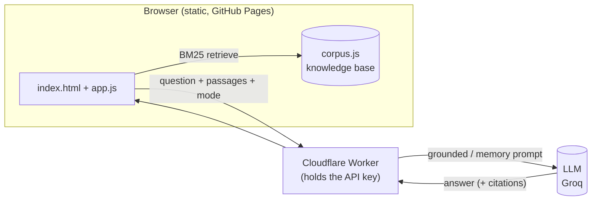

# How RAG works, stage by stage

A short technical reference for this demo. RAG stands for **Retrieval-Augmented Generation**.

A plain language model answers from **memory**: the patterns baked into its weights during
training. That memory can be stale, it cannot cite anything, and it can be confidently wrong.
RAG adds one idea: **before the model answers, fetch relevant documents and make it answer from
those, with citations.** The result is current (you update documents, not the model), checkable
(every claim has a source), and honest (it can say "not in the sources" instead of guessing).

## The pipeline


### Stage 0 — Indexing (done ahead of time)
**Simple:** build the knowledge base the system is allowed to use.
**Technical:** documents are split into small **chunks**, each stored with its text and a source link.
**In this demo:** `scripts/fetch_corpus.mjs` pulls live **openFDA** drug labels and food recalls,
merges them with a dozen curated reference facts, and writes `corpus.js` (about 28 chunks, each
`{ id, title, text, source, url, type }`).

### Stage 1 — Retrieval
**Simple:** find the few documents most related to the question.
**Technical:** score every chunk against the query and keep the top **k**. This demo uses **BM25**,
a classic lexical (keyword) ranking function:

```
score(D, Q) = Σ  IDF(t) · ( f(t,D) · (k1 + 1) ) / ( f(t,D) + k1 · (1 - b + b · |D| / avgdl) )
            t∈Q

IDF(t) = ln( 1 + (N - n(t) + 0.5) / (n(t) + 0.5) )
```

where `f(t,D)` is term frequency, `|D|` is document length, `avgdl` is the average length, `N` is the
number of chunks, and `n(t)` is how many chunks contain term `t`. Constants used here: `k1 = 1.5`,
`b = 0.75`.
**In this demo:** `app.js` tokenizes (lowercase, split on non-alphanumerics, drop very short words and
stopwords), scores with BM25 in the browser, and keeps `TOP_K = 4` (set in `config.js`). No server,
instant, and easy to explain.

### Stage 2 — Augmentation
**Simple:** hand those passages to the model with the question.
**Technical:** the retrieved chunks are numbered and inserted into the prompt, with an instruction to
answer **only** from them and to cite by number.
**In this demo:** `app.js` sends `{ question, sources: [{n, title, text}], mode: "grounded" }` to the
Worker, which builds the prompt: the question, then `[1] title: text`, `[2] ...`, plus a system message
that enforces grounding.

### Stage 3 — Generation
**Simple:** the model writes the answer from those passages.
**Technical:** the LLM is prompted to stay inside the provided context. A low temperature keeps it
faithful. If the answer is not in the passages, it must say so.
**In this demo:** `cloudflare-worker.js` calls the LLM (Groq, `llama-3.3-70b-versatile`) at
`temperature 0.2` with a strict system prompt: cite inline as `[1]`, refuse personal medical advice,
and if the sources do not contain the answer, reply exactly "The provided FDA sources do not cover this."

### Stage 4 — Citation and verification
**Simple:** show the answer next to the documents it used, so a human can check.
**Technical:** the `[n]` markers in the answer link back to the retrieved chunks and their source URLs.
**In this demo:** `app.js` turns each `[n]` into a chip and lists the sources with "view source" links.
A claim with no source is a red flag, by design.

## Architecture of this demo



Everything is JavaScript: the browser does retrieval, the Worker is a thin proxy that keeps the API key
off the public page and calls the model, and the model returns the answer. RAG is an architecture, not a
language, so no Python is required.

## Memory vs RAG (what the demo contrasts)

The same model is called two ways:

| | From memory (`mode: "memory"`) | With sources (`mode: "grounded"`) |
| --- | --- | --- |
| Retrieval | skipped | BM25 over the corpus |
| Prompt | just the question | question + retrieved passages |
| Citations | none | inline `[n]` to real sources |
| If it does not know | may answer anyway | says the sources do not cover it |

Both answers can sound equally confident. Only the grounded one can be checked. That is the point of RAG.

## Design choices and trade-offs

- **Lexical vs semantic retrieval.** BM25 matches words. The "upgrade" is **embeddings**: encode each
  chunk and the query as vectors and retrieve by meaning using a vector index (FAISS, pgvector, etc.).
  Embeddings handle paraphrase and synonyms better; BM25 needs no model, is instant, and is transparent.
  For a small, factual corpus and a live demo, BM25 is the robust default.
- **Chunking and top-k.** Smaller chunks retrieve more precisely but carry less context. `k` trades
  recall (more passages) against prompt size and noise. Here, short chunks and `k = 4`.
- **Grounding strictness.** A firm system prompt plus showing the sources is "soft" grounding. Stricter
  setups verify each sentence against the passages before returning the answer.
- **Safety.** The corpus is scoped to public FDA data, and both modes refuse personal medical advice or
  dosing. RAG limits the model to a trusted source set, which is itself a safety control.

## Quick glossary

- **Corpus / chunk:** the document set, split into small passages.
- **Retriever:** the component that ranks chunks for a query (here, BM25).
- **BM25:** a lexical ranking function based on term frequency and rarity.
- **Embeddings / vector DB:** the semantic alternative, retrieval by meaning.
- **Top-k:** how many passages are retrieved per question.
- **Context window:** how much text the model can read at once; the prompt budget.
- **Grounding:** restricting the answer to the retrieved sources.
- **Citation:** the link from a claim back to its source.
- **Hallucination:** a fluent claim with no basis in the sources or reality.
