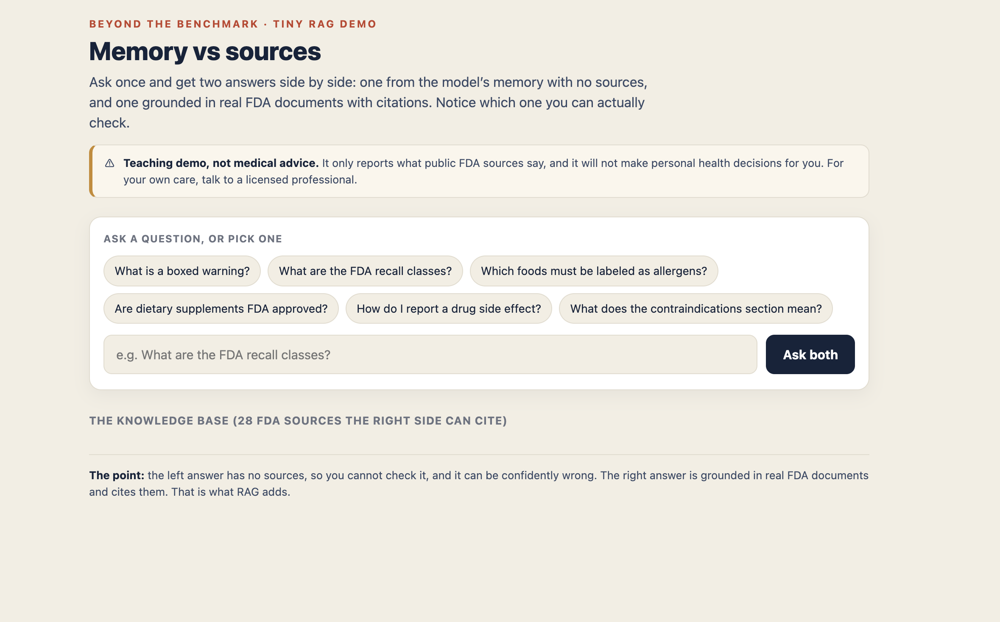
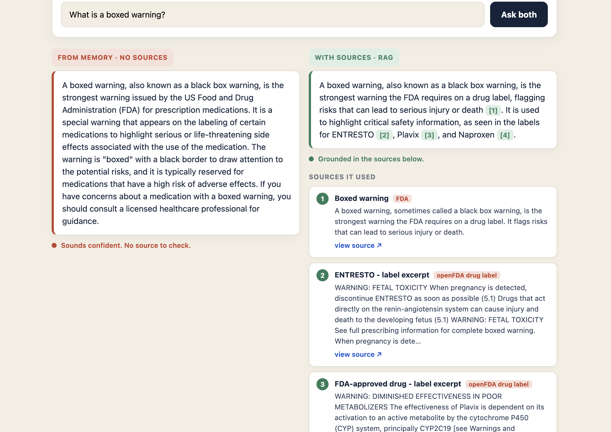

# Memory vs Sources: a tiny RAG demo on FDA data

A small, real **RAG** (retrieval-augmented generation) chatbot built for the FOR 2026 workshop
*Beyond the Benchmark*. You ask one question and get **two answers side by side**: one from the
model's memory with no sources, and one **grounded in real FDA documents with citations**. The
point is not the answer, it is that you can check it.

**Live demo:** https://pa1kcool.github.io/fda-ragmodel/



Ask a question and the two answers appear next to each other. The left side answers from memory
with nothing to verify. The right side retrieves real FDA passages, answers only from them, and
cites each one so you can open it.



---

## What it teaches

A fluent answer and a grounded answer can look equally confident. Only one lets you check where it
came from. In high-stakes fields, that difference is everything. This demo makes it visible on real,
public FDA data.

## How it works (RAG in four steps)

1. **You ask a question.**
2. **Retrieve.** The page searches its FDA document set and pulls the few most relevant passages,
   using BM25 (a classic keyword-relevance method). No server, instant, and explainable.
3. **Augment.** Those passages are sent to the model with the instruction to answer using only them.
4. **Generate.** The model writes an answer grounded in those passages and cites them like `[1]`.

The "from memory" side deliberately skips steps 2 and 3, so you can see what RAG adds.

## The stack (and why there is no Python)

Everything is JavaScript. RAG is an architecture, not a language.

- **Browser** (`index.html`, `app.js`): plain HTML, CSS, and vanilla JS. Runs the retrieval and shows the answers.
- **Data prep** (`scripts/fetch_corpus.mjs`): Node.js. Pulls live data from openFDA.
- **Proxy** (`cloudflare-worker.js`): a Cloudflare Worker (JavaScript) that holds the API key so the public page never exposes it, and calls the model.

The only Python you might use is `python3 -m http.server` to preview locally, which is just a throwaway
web server. Any static server works.

## The data

Public **openFDA** data: drug label excerpts (including boxed warnings) and recent food recalls, plus
a dozen short plain-language reference facts so definition questions answer cleanly. It is real,
public, free, and citable, and it carries genuine stakes without being personal medical advice.

---

## Reproduce it yourself

You need a free GitHub account, a free Cloudflare account, a free model API key (for example Groq at
console.groq.com), and Node 18+.

**1. Get the files and load real data**
```bash
node scripts/fetch_corpus.mjs        # writes corpus.js from live openFDA (Node 18+, internet)
python3 -m http.server 8000          # optional local preview at http://localhost:8000
```

**2. Deploy the model proxy (Cloudflare Worker)**
```bash
npm install -g wrangler
wrangler login
wrangler deploy                      # prints your Worker URL
wrangler secret put LLM_API_KEY      # paste your model API key when prompted
```
The repo includes a `wrangler.toml`. If you are not using Groq, change `API_URL` and `MODEL` at the
top of `cloudflare-worker.js` first.

**3. Connect the page to the proxy**
Open `config.js` and set `WORKER_URL` to your Worker URL.

**4. Publish the page on GitHub Pages**
```bash
git init && git add . && git commit -m "FDA RAG demo"
git branch -M main
# create a public repo, push to it, then:
# repo Settings -> Pages -> Deploy from a branch -> main -> /(root)
```
Your site appears at `https://<your-username>.github.io/<repo>/`.

If no model is connected, the app still runs in **evidence-only mode**: it retrieves and shows the
cited sources, so it never hard-fails.

---

## Project files

| File | What it does |
| --- | --- |
| `index.html` | The page: layout, question box, the two answer columns, styling. |
| `app.js` | Retrieval (BM25), calls the proxy for both answers, renders them with citations. |
| `config.js` | One setting: your Worker URL. |
| `corpus.js` | The knowledge base, the FDA documents it can search and cite. |
| `scripts/fetch_corpus.mjs` | Pulls live openFDA data and rebuilds `corpus.js`. |
| `cloudflare-worker.js` | The proxy that holds your key and calls the model in two modes. |

## Safety and limits

- **Not medical advice.** It only reports what public FDA sources say and refuses personal medical decisions.
- **Retrieval can miss.** BM25 matches words, so if it grabs the wrong passage, the answer reflects that. That is a useful lesson, not a bug.
- **Free tiers rate-limit.** Many users at once may hit a limit; the app falls back to showing the cited sources.
- **Lock down CORS for real use.** In `cloudflare-worker.js`, replace the `*` origin with your Pages origin.
- Want semantic retrieval? Swap BM25 for vector embeddings and a vector index. BM25 is the robust default for a small corpus and a live demo.
